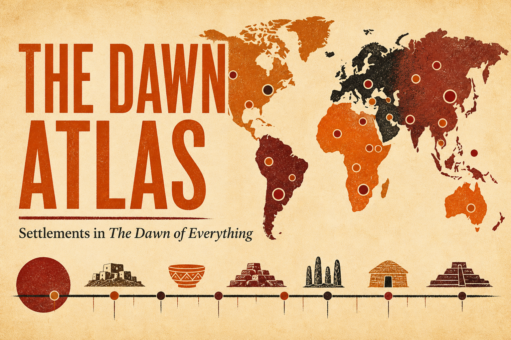

# The Dawn Atlas

An interactive atlas of the 174 human settlements mentioned in David Graeber and David Wengrow's [*The Dawn of Everything*](https://dawnofeverything.industries/). The atlas connects each place to its passages in the book and lets readers explore the collection by geography, occupation period, settlement type, and chapter.

[Open the atlas](https://matthewgthomas.github.io/dawn-of-everything/)



## The data

The dataset is a paragraph-level catalogue of places where people lived together, as described in the book's substantive text and notes. It contains 174 settlements, 668 settlement–paragraph mentions, and 295 bibliography entries linked through the book's notes.

The extraction process combined automated discovery with manual curation:

1. A copy of the e-book was divided into source paragraphs and labelled by chapter, notes section, and original line number. Front matter and back matter that did not form part of the substantive scope were excluded.
2. A high-recall candidate list was produced with spaCy named-entity recognition and rules for phrases such as “city of”, “village”, and “archaeological site”. This stage was intended to find a broad list of possible places rather than deciding what counted as a settlement.
3. Candidates were reviewed and consolidated in [`data/settlement_curation.csv`](data/settlement_curation.csv). This curation records canonical names, aliases used in the book, settlement types, occupation dates, selection hints, and notes. Countries, regions, rivers, cultures, fictional places, individual buildings, and unnamed settlements were excluded.
4. Candidate names were matched against Wikidata to obtain representative coordinates, descriptions, and external links. Ambiguous matches were reviewed, documented manual overrides were used where necessary, and three places remain unlocated because the evidence does not support a unique geographical point.
5. The build script matched every curated settlement and alias back to the source paragraphs, linked note citations to full bibliography entries, and generated the CSV and JSON files in [`data/derived`](data/derived).
6. A separate validator checked IDs, joins, coordinates, date ranges, citation links, source line ranges, and paragraph fidelity. The current dataset passes all 20 checks.

Occupation dates are a reference synthesis for the dataset, not necessarily claims made in the passage where a place appears. Coordinates are representative points rather than settlement boundaries. For the full scope definition, table schemas, date conventions, provenance notes, and rebuild commands, see the [data methodology](data/README.md).

The source book text and temporary extraction/Wikidata files are excluded from the repository. They are not needed to run the app because the final derived dataset is committed.

## How the app works

The atlas is a static, client-side React application; it has no backend or database. At build time, [`src/data.ts`](src/data.ts) imports [`data/derived/dataset.json`](data/derived/dataset.json), joins mention records to their settlements, converts numeric fields, and prepares searchable text and derived metadata.

The application keeps the current search, filters, selected settlement, and comparison list in React state. Full-text search covers names, aliases, settlement types, descriptions, chapters, and passage text. Results are ranked by relevance and explain why they matched; passage matches include a highlighted excerpt and open the settlement directly at the strongest matching passage. Filters are organised around book chapters, occupation-era presets, broad place categories, specific settlement types, and optional exact start/end dates. Search and filters update the result count, map, and timeline together, with each active filter shown as a removable chip.

On desktop, the map and timeline form the main workspace. The complete settlement list is available in a contextual results drawer, which opens automatically once per focused search session when a query reaches two characters. New visitors also see a dismissible **Start exploring** card with shortcuts to a featured settlement, Chapter 8, and the earliest sites. A compact discovery panel beneath the map changes with the current selection and filters.

The world map uses D3's Equal Earth projection and country geometry from `world-atlas`. Nearby points are clustered according to zoom level; selecting a cluster zooms in, while selecting a place opens its record. The timeline plots known occupation intervals across BCE and CE dates, with a density overview, adjustable range, zoom controls, and presets from the earliest sites to later settlements.

Settlement details are split into **Overview**, **Passages**, and **References** views. The overview leads with a representative book passage before location and curation metadata; the Passages view groups paragraphs by book section and prioritises search matches. Settlements can be pinned from the results, timeline, or detail view. The first pin prompts the reader to add another, and two to four places unlock a side-by-side comparison with chapter coverage, shared and unique chapters, linked-reference counts, and optional additional metadata.

On screens 900px wide and below, results, map, and timeline become separate tabbed views, and a meaningful search switches to Results automatically. Drawers become near-full-width or full-screen where appropriate, while the map uses a more compact responsive layout. Search, filters, selection, and comparison are written to the URL, making a view shareable; settlement navigation also works with the browser Back button. Keyboard users can focus search with <kbd>⌘</kbd>/<kbd>Ctrl</kbd> + <kbd>K</kbd> and close the active drawer with <kbd>Esc</kbd>. Dialogs trap focus while open and restore it to the invoking control when closed.

## Tech stack

- React 19 and TypeScript for the UI and application logic
- Vite 6 for local development and production builds
- D3 for map projection, paths, zooming, and panning
- TopoJSON, `world-atlas`, and Natural Earth-derived country geometry for basemaps
- Lucide React for interface icons and Fontsource for bundled web fonts
- Plain CSS for the responsive layout and visual design
- Vitest, jsdom, and Testing Library for unit and component tests
- Python, spaCy, regular expressions, and Wikidata SPARQL results for the data pipeline

## Run locally

You will need Node.js 18, 20, or 22+ and npm.

```sh
git clone https://github.com/matthewgthomas/dawn-of-everything.git
cd dawn-of-everything
npm ci
npm run dev
```

Open the local URL printed by Vite, normally [http://localhost:5173](http://localhost:5173).

The checked-in derived data is sufficient to run the app. To create and preview a production build:

```sh
npm run build
npm run preview
```

Run the test suite with:

```sh
npm test
```

## React components

| Component | Description |
| --- | --- |
| [`App`](src/App.tsx) | Owns shared state and composes the search band, active-filter chips, onboarding and discovery cards, map/timeline workspace, responsive tabs, drawers, browser history, URL synchronisation, and comparison workflow. |
| [`WorldMap`](src/WorldMap.tsx) | Projects located settlements onto an interactive Equal Earth map, clusters nearby markers, and handles pan, zoom, reset, selection, and pinned-place labels. |
| [`Timeline`](src/Timeline.tsx) | Sorts and plots occupation intervals, provides timeline presets, a density overview, an adjustable time window and zoom controls, and supports selecting or pinning a place. |
| [`ResultsPanel`](src/ResultsPanel.tsx) | Renders the desktop results drawer and mobile results view, including relevance explanations, highlighted passage excerpts, empty states, selection, and comparison pinning. |
| [`FilterPanel`](src/FilterPanel.tsx) | Provides chapter/section, occupation-era, broad place-category, specific type, and advanced BCE/CE date filters with a live result count. |
| [`DetailDrawer`](src/DetailDrawer.tsx) | Presents tabbed overview, passage, and reference views; groups paragraphs by book section; focuses search matches; and includes location, curation, and external-reference metadata. |
| [`SettlementLocationMap`](src/SettlementLocationMap.tsx) | Renders the small world locator map used inside the settlement detail drawer. |
| [`CompareTray`](src/CompareTray.tsx) | Prompts for a second pin, then compares up to four settlements across core metadata, references, chapter coverage, and shared or unique chapters, with controls for reordering, removing, and clearing places. |
| [`AboutPanel`](src/AboutPanel.tsx) | Introduces the atlas, offers exploration shortcuts, and summarises the dataset's scope, caveats, methodology links, and project attribution. |

Supporting modules in [`src/data.ts`](src/data.ts), [`src/filtering.ts`](src/filtering.ts), [`src/mapClustering.ts`](src/mapClustering.ts), [`src/HighlightedText.tsx`](src/HighlightedText.tsx), and [`src/useDialogFocus.ts`](src/useDialogFocus.ts) handle data normalisation, relevance ranking and URL serialisation, zoom-aware map clustering, accessible query highlighting, and dialog focus management respectively. [`src/main.tsx`](src/main.tsx) loads the fonts and global styles and mounts the app.

## License, rights and independence

The project code is available under the [MIT License](LICENSE).

This is an independent, unofficial atlas. It is not affiliated with, authorized by, or endorsed by David Graeber, David Wengrow, or Penguin Random House.

The book text, passages, notes, and bibliography are copyright © 2021 David Graeber and David Wengrow. All rights remain with the applicable rights holders. The project’s MIT License applies only to its original code; it does not license quoted book content or third-party data.

External links are provided for reference and do not imply endorsement. Dates, locations, descriptions, and other atlas metadata are a research synthesis, may be incomplete or contain errors, and should not be treated as authoritative scholarship.